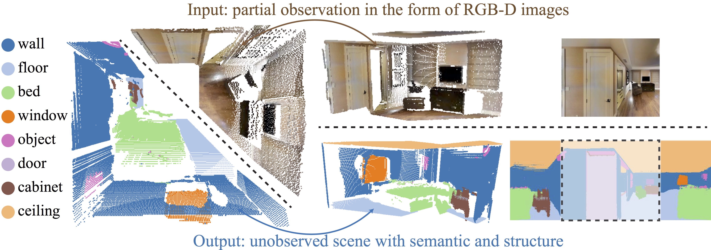
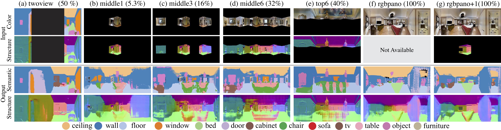

## Im2Pano3D: Extrapolating 360° Structure and Semantics Beyond the Field of View

This repo contains training and testing code for our paper on Im2Pano3D.
More information about the project can be found in our [paper](https://arxiv.org/pdf/1712.04569.pdf) and [project webset](http://im2pano3d.cs.princeton.edu/)



### Organization
The code and data is organized as follows:
``` shell
    im2pano3d
         |-- matlab_code
         |-- torch_code
         |-- models
         |-- datalist
         |-- data
                |-- mpv3  
                |-- suncgpano  
```
### Installation
0. Requirements for torch (see: torch installation instructions)
0. Install torch-hdf5

```
sudo apt-get install libhdf5-serial-dev hdf5-tools
git clone https://github.com/deepmind/torch-hdf5
cd torch-hdf5
luarocks make hdf5-0-0.rockspec LIBHDF5_LIBDIR="/usr/lib/x86_64-linux-gnu/"
```


### Download
0. Dwonload training and testing panorama data: ./download_pano_data.sh [41 G]


### Training  

Export path

```
export LD_LIBRARY_PATH=$LD_LIBRARY_PATH:/usr/local/cudnn/v5/lib64
```

Train on SUNCG data

```
cd torch_code/
name=suncg maskType=twoview   loss_xyz=1 loadOpt=rgbpns  Gtype_in=rgbpns   Gtype_out=pns  dataset=suncg  dataPath=../data/suncgpano/ DATA_ROOT=../datalist/trainlist_suncgroom8_10000.txt gpu=1 th train.lua  2>&1 | tee ./checkpoints/training_suncg.log
```

Train on Matterport3D data

```
cd torch_code/
name=mp maskType=twoview   loss_xyz=1 loadOpt=rgbpns  Gtype_in=rgbpns   Gtype_out=pns  dataset=mp  dataPath=../data/mpv3/  DATA_ROOT=../datalist/trainlist_mp3.txt gpu=1 th train.lua  2>&1 | tee ./checkpoints/training_suncg.log
```

0. Supported input output modalities:

|Gtype_in| Gtype_out | loadOpt   |
|--- | --- | ---|
|(input)   | (output)    | (load type) |
|pns     | pns       | pns       |
|rgbpn   | pns       | rgbpns    |
|rgbpns  | pns       | rgbpns    |
|rgb     | pns       | rgbpns    |

0. Supported mask types (maskType):\
twoview: Input two views of the panorama and predicts the other two. (a)\
1camera: one normnal camera (b)\
3camera: three normnal camera (c)\
middlecamera: Input six RGB-D camera looking horizantoally forward (d)\
upcamera: Input six RGB-D camera looking upwards (e) \
random: random mask \
nomask: No mask applied in the input image. Example usage, input rgb panorama output pns.(f)\



### Testing 

```
name=mp_twoview_rgbpns  maskType=twoview dataset=suncg dataPath=../data/suncgpano/ checkpoints_dir=../checkpoints  DATA_ROOT=../datalist/testlist_suncgroom8.txt how_many=480 th test.lua
```

Testing with pre-trained models:

```
name=mpft_suncg_pns_pns_twoview  maskType=twoview dataset=suncg dataPath=../data/suncgpano/  checkpoints_dir=../models DATA_ROOT=../datalist/testlist_suncgroom8.txt how_many=480 th test.lua
```

### Data Details 

Panorama data representation


Depth encoding conversion example in Matlab


### Acknowledgment
Code is inspired by [DCGAN](https://github.com/soumith/dcgan.torch), [DCGAN](https://github.com/soumith/dcgan.torch),  [Context-Encoder](https://github.com/pathak22/context-encoder) and [pix2pix](https://github.com/phillipi/pix2pix).


